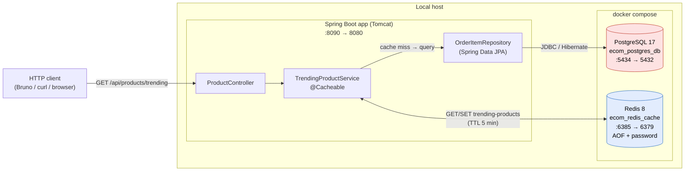
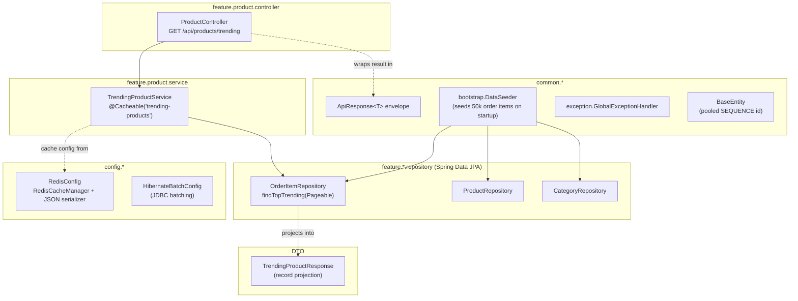
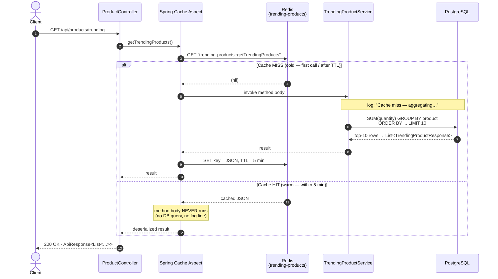
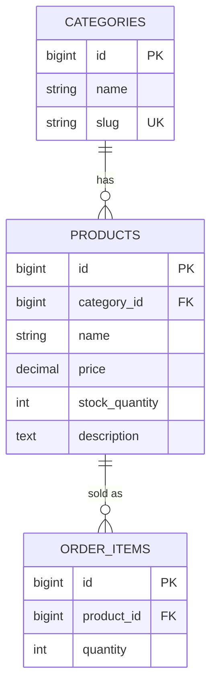
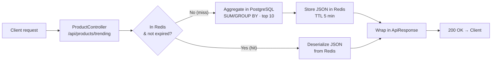

# System Architecture — Redis-Cached Trending Products

This document visualizes the demo system: a Spring Boot 4 / Java 21 web app that
serves two **cache-aside** read paths, backed by **PostgreSQL** (source of
truth) and accelerated by **Redis** (cache layer):

* `GET /api/products/trending` — *trending-products analytics*, deliberately
  expensive on a cold call (a `SUM`/`GROUP BY` over 50,000 `order_items`) so the
  win from caching it in Redis is easy to observe.
* `GET /api/products/{id}` — *high-concurrency product-detail read*, kept warm in
  Redis so a flood of concurrent reads is answered without borrowing a
  PostgreSQL connection (the load-test target — see the product-detail section
  below and [bench/README.md](bench/README.md)).

---

## 1. Deployment / container view

How the running pieces fit together. The Spring Boot app talks to two
Docker-managed backing services. Host ports differ from container ports (see
[CLAUDE.md](CLAUDE.md) and the env-var notes) to avoid clashes with other
local stacks.



> Ports `5434 / 6385 / 8090` are this project's host-port choices (the defaults
> `5432 / 6379 / 8080` are taken by other local stacks). The same `.env` value
> drives both the docker mapping and the Spring connection.

---

## 2. Application layering (packages → responsibilities)

The codebase is split into a **feature-sliced** domain (`feature/*`) plus a
shared `common/*` layer and an infrastructure `config/*` layer. Caching plumbing
is kept out of the domain code.



---

## 3. The Redis cache-aside flow (the heart of the demo)

`TrendingProductService.getTrendingProducts()` is annotated `@Cacheable`, so
Spring's caching aspect intercepts the call. The **first** call is a cache miss
(slow Postgres aggregation); every call within the **5-minute TTL** is a cache
hit served straight from Redis without touching the DB.



**Key (cache layout in Redis):**

| Property        | Value                                                                   |
|-----------------|-------------------------------------------------------------------------|
| Cache bucket    | `trending-products` (`RedisConfig.TRENDING_PRODUCTS_CACHE`)             |
| Redis key       | `trending-products::getTrendingProducts` (`key = "#root.methodName"`)   |
| TTL             | 5 minutes (configured in `RedisConfig`)                                |
| Value format    | JSON via `GenericJacksonJsonRedisSerializer` (Jackson 3, default typing)|
| Why default typing | so `List<TrendingProductResponse>` round-trips to its concrete type, not `LinkedHashMap` |

> **Observing it:** a cold call logs `Cache miss — aggregating top 10 trending
> products from PostgreSQL` and responds slowly; a warm call logs nothing and
> responds fast. To force a fresh cold path, delete the key:
> `redis-cli -a "$REDIS_PASSWORD" DEL "trending-products::getTrendingProducts"`.

---

## 4. Data model (ERD)

The aggregation joins `order_items → products`; categories exist for the broader
catalog. All ids come from one shared pooled `SEQUENCE` (`BaseEntity`), and all
associations are `LAZY` so the analytics query never hydrates entities.



Seeded by `DataSeeder` on `ApplicationReadyEvent` (idempotent — skips if any
categories exist): **20 categories · 1,000 products · 50,000 order items**,
bulk-inserted with Hibernate JDBC batching to make the cold aggregation
genuinely slow.

---

## 5. Request lifecycle at a glance



---

## 6. Second battleground — high-concurrency product-detail reads

A different shape of cache win: not an expensive aggregation, but a *hot key*.
`GET /api/products/{id}` is served by `ProductService.getProductById`, annotated
`@Cacheable(cacheNames = "products", sync = true)`. Once an id is warm, a flood
of concurrent reads is answered entirely from Redis and the PostgreSQL
connection pool stays idle.

```mermaid
sequenceDiagram
    autonumber
    actor C as Clients<br/>(1000s, concurrent)
    participant API as ProductController
    participant Aspect as Spring Cache Aspect<br/>(sync = true)
    participant R as Redis<br/>(products)
    participant S as ProductService
    participant DB as PostgreSQL

    C->>API: GET /api/products/{id}
    API->>Aspect: getProductById(id)
    Aspect->>R: GET "products::{id}"

    alt Cache HIT (warm — the spike)
        R-->>Aspect: cached JSON
        Aspect-->>API: ProductResponse (no DB query)
    else Cache MISS (cold — first request only)
        Note over Aspect,DB: sync=true → a per-key lock admits ONE loader;<br/>concurrent callers block, then read the fresh value
        Aspect->>S: invoke method body (single thread)
        S->>DB: select … from products where id = ?
        DB-->>S: row → ProductResponse
        S-->>Aspect: result
        Aspect->>R: SET "products::{id}" = JSON, TTL = 10 min
        Aspect-->>API: result
    end

    API-->>C: 200 OK · ApiResponse<ProductResponse>
```

**Key (cache layout in Redis):**

| Property        | Value                                                                   |
|-----------------|-------------------------------------------------------------------------|
| Cache bucket    | `products` (`RedisConfig.PRODUCTS_CACHE`)                               |
| Redis key       | `products::{id}` (`key = "#id"`)                                        |
| TTL             | 10 minutes (configured in `RedisConfig`)                               |
| Stampede guard  | `@Cacheable(sync = true)` — one loader per key on a cold miss          |
| Value format    | `ProductResponse` record as JSON (same Jackson-3 serializer as above)  |

The dangerous case is a *cold spike*: thousands of simultaneous requests for an
id that is **not** yet cached. Without `sync = true` they would all stampede the
connection pool; with it, exactly one thread loads from PostgreSQL while the rest
block briefly and then read the freshly-cached value. The
[bench harness](bench/README.md) drives this scenario with Bombardier.

---

### Component reference

| Concern               | Type / file                                                                 |
|-----------------------|------------------------------------------------------------------------------|
| HTTP endpoint         | [ProductController](src/main/java/com/example/demo/feature/product/controller/ProductController.java) |
| Trending read logic   | [TrendingProductService](src/main/java/com/example/demo/feature/product/service/TrendingProductService.java) |
| Aggregation query     | [OrderItemRepository](src/main/java/com/example/demo/feature/order/repository/OrderItemRepository.java) |
| Trending projection   | [TrendingProductResponse](src/main/java/com/example/demo/feature/product/dto/TrendingProductResponse.java) |
| Product-detail read   | [ProductService](src/main/java/com/example/demo/feature/product/service/ProductService.java) (+ `ProductServiceImpl`) |
| Product CRUD          | [ProductRepository](src/main/java/com/example/demo/feature/product/repository/ProductRepository.java) |
| Detail projection     | [ProductResponse](src/main/java/com/example/demo/feature/product/dto/ProductResponse.java) |
| Redis cache wiring    | [RedisConfig](src/main/java/com/example/demo/config/RedisConfig.java)        |
| Response envelope     | [ApiResponse](src/main/java/com/example/demo/common/api/ApiResponse.java)    |
| Benchmark data        | [DataSeeder](src/main/java/com/example/demo/common/bootstrap/DataSeeder.java) |
| Backing services      | [docker-compose.yml](docker-compose.yml) (Postgres 17, Redis 8)              |
