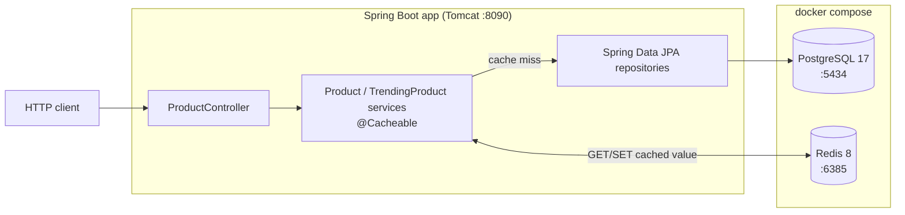

# E-Commerce Catalog — Redis Cache Performance Demo

A Spring Boot 4 / Java 21 web app that demonstrates and measures the performance
difference between reading an e-commerce product catalog **straight from
PostgreSQL** versus **accelerating it with Redis** via Spring's cache
abstraction (`@Cacheable`, cache-aside pattern).

Scope is deliberately minimal — **Catalog Management** only (category browsing &
product lookup). Auth, cart, and checkout are out of scope. See
[docs/project_spec.md](docs/project_spec.md) for the full specification.

## Purpose

Quantify response time, throughput, and resource use across the two "battleground"
read paths where caching pays off most:

| Endpoint | What it stresses | Cold (no cache) | Warm (Redis) |
|----------|------------------|-----------------|--------------|
| `GET /api/products/trending` | Heavy `SUM`/`GROUP BY` aggregation over 50k order items | ~1000–3000 ms | < 10 ms |
| `GET /api/products/{id}` | High-concurrency hot-key read (stampede-guarded) | DB pool exhaustion under load | Stable, < 10 ms p99 |

## Tech Stack

- **Backend:** Java 21, Spring Boot 4.0.6, Spring Data JPA, Spring Cache, Lombok
- **Database (source of truth):** PostgreSQL 17 (Docker)
- **Cache:** Redis 8 (Docker, AOF + password)
- **Build:** Maven (via `./mvnw` wrapper) — packaged as a WAR with provided Tomcat
- **Benchmarking:** [Bombardier](https://github.com/codesenberg/bombardier) 1.2.6

## Architecture

The app exposes two cached read paths. On a miss it queries PostgreSQL and
populates Redis; within the per-bucket TTL, reads are served entirely from Redis.



| Cache bucket | Key | TTL | Backing read |
|--------------|-----|-----|--------------|
| `trending-products` | `getTrendingProducts` | 5 min | top-10 aggregation |
| `products` | product `id` | 10 min | product-detail (`sync = true` stampede guard) |

The codebase is **feature-sliced** under `com.example.demo`:

- `feature/product` — controller, services (caching lives here), DTOs
- `feature/category`, `feature/order` — supporting entities & repositories
- `common/*` — `ApiResponse` envelope, exception handling, `BaseEntity`, `DataSeeder`
- `config/*` — `RedisConfig` (cache manager + Jackson-3 JSON serializer)

On startup `DataSeeder` idempotently loads **20 categories · 1,000 products ·
50,000 order items**. Detailed diagrams live in [docs/project_spec.md](docs/project_spec.md).

## Prerequisites

- Java 21 (JDK)
- Docker + Docker Compose
- A `.env` file (copy from [.env.example](.env.example) and fill in values)

> `application.properties` references env vars with **no fallback defaults**, and
> `.env` is loaded by docker-compose only — not by Spring Boot. `run.sh` exports
> it for you; for raw `./mvnw` commands you must export the vars yourself.

## Quick Start

```bash
cp .env.example .env        # then fill in POSTGRES_*, REDIS_*, APP_NAME, SERVER_PORT
chmod +x run.sh
./run.sh                    # starts Postgres + Redis, exports .env, runs the app
```

Then hit the endpoints:

```bash
curl http://localhost:8090/api/products/trending
curl http://localhost:8090/api/products/1002
```

> Default host ports `5432/6379/8080` are often taken; this project uses
> `5434/6385/8090`. Product id `1` is a Category and 404s by design (a
> cache-penetration example); real product ids start around `1002`.

### Other commands

```bash
docker compose up -d                 # start Postgres + Redis only
./mvnw clean package                 # build -> target/demo-0.0.1-SNAPSHOT.war
./mvnw test                          # requires live Postgres + Redis with env vars exported
```

## Benchmarking

```bash
./bench/install-bombardier.sh        # one-time: download the binary (no sudo)
./run.sh                             # terminal 1: start infra + app
./bench/run-benchmark.sh             # terminal 2: prime then spike the hot endpoint
```

The script auto-discovers the #1 trending product id and reports cold-vs-warm
latency before firing the spike. See [bench/README.md](bench/README.md) for knobs
and how to prove the DB connection pool stays idle.

## API

| Method | Endpoint | Description |
|--------|----------|-------------|
| `GET` | `/api/products/trending` | Top-10 best-selling products (cached aggregation) |
| `GET` | `/api/products/{id}` | Product detail by id (cached hot-key read) |

All responses use the common `ApiResponse<T>` envelope. Advanced search and a
cache-invalidating update endpoint are described in the spec but not yet
implemented.
